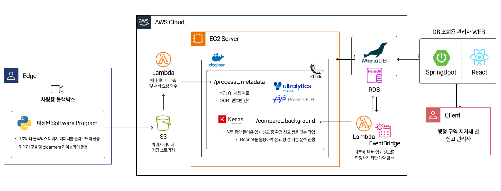

# Gotcha Cloud Service

Gotcha는 **AI 기반 불법주정차 자동 신고 서비스**로, 클라우드 인프라를 통해 이미지 처리, 메타데이터 분석 및 데이터베이스 관리를 수행합니다.  

---

## 📚 **프로젝트 개요**

- **목표**: 불법주정차 차량 탐지 및 자동 신고를 위한 **클라우드 AI 백엔드 서비스** 제공
- **기능**:
  1. S3에 업로드된 이미지 메타데이터 처리 및 EC2 서버 호출
  2. AI 모델 (차량 탐지 및 번호판 인식) 처리
  3. RDS 데이터베이스에 임시 → 확정 데이터 저장
  4. 배경 분석 API를 통해 중복 신고 필터링

---

## 🛠️ **폴더 구조**

```
📂 Gotcha-cloud
├── 📂 lambda
│   ├── 📂 s3-triggered-lambda        # S3 트리거 메타데이터 추출 Lambda 함수
│   │   ├── lambda_function.py        # Lambda 함수 메인 코드
│   │   └── requirements.txt          # 의존성 패키지 목록
│   └── 📂 temporary-to-final-lambda  # RDS 임시 -> 확정 데이터 처리 Lambda 함수
│       ├── lambda_function.py        # Lambda 함수 메인 코드
│       └── requirements.txt          # 의존성 패키지 목록
├── 📂 ec2-server
│   ├── Dockerfile                    # Docker 설정 파일
│   ├── app.py                        # Flask 메인 서버
│   └── requirements.txt              # 의존성 패키지 목록
│
├── 📂 rds
│   ├── schema.sql                    # 테이블 스키마 정의
│   └── init_data.sql                 # 초기 데이터 삽입용 SQL
│
├── 📂 docs
│   ├── architecture.png              # 시스템 아키텍처 다이어그램
│   └── api-spec.md                   # API 명세서
│
├── .env                              # 환경 변수 설정 파일
└── README.md                         # 프로젝트 설명 및 실행 방법
```

---

## 🚀 **구성 요소 설명**

### 1. **Lambda**
- **S3 트리거 Lambda**:
   - **역할**: S3에 업로드된 이미지에서 메타데이터를 추출하고 EC2 서버의 `/process_metadata` API를 호출.
   - **의존성**: `boto3`, `Pillow`, `piexif`, `requests`

- **Temporary to Final Lambda**:
   - **역할**: RDS `temporary` 테이블 데이터를 필터링하여 `final` 테이블에 저장.
   - **의존성**: `pymysql`, `requests`

### 2. **EC2 서버**
- **Flask 기반 API 서버**:
   - `/process_metadata`: 차량 및 번호판 탐지 후 데이터를 RDS에 저장.
   - `/compare_background`: 배경 분석 및 중복 신고 필터링.
- **AI 모델**:
   - YOLO: 차량 탐지
   - PaddleOCR: 번호판 인식
   - Keras ResNet: 배경 분석

### 3. **RDS**
- **Temporary 테이블**: 임시 신고 데이터를 저장.
- **Final 테이블**: 중복 필터링 및 확정된 데이터를 저장.

### 4. **문서 및 다이어그램**
- **architecture.png**: 시스템 전체 흐름도
- **api-spec.md**: API 사용 방법 및 설명

---

## 💻 **실행 방법**

### 1. 환경 변수 설정
`.env` 파일을 생성하고 아래 내용을 추가:
```plaintext
AWS_ACCESS_KEY_ID=your-access-key
AWS_SECRET_ACCESS_KEY=your-secret-key
AWS_REGION=ap-northeast-2
RDS_HOST=your-rds-endpoint
RDS_USERNAME=your-username
RDS_PASSWORD=your-password
```

### 2. Lambda 배포
```bash
cd lambda/s3-triggered-lambda
zip -r function.zip .
aws lambda update-function-code --function-name S3TriggeredFunction --zip-file fileb://function.zip
```

### 3. EC2 서버 실행
```bash
cd ec2-server
docker build -t gotcha-server .
docker run -d -p 5000:5000 --env-file ../.env gotcha-server
```

### 4. RDS 초기화
```sql
SOURCE rds/schema.sql;
SOURCE rds/init_data.sql;
```

---

## 📊 **아키텍처**


---

## 📄 **API 명세**
API 명세서는 [api-spec.md](docs/api-spec.md)를 참고해주세요.

---

## 📝 **기타**
- 민감 정보 (Access Key, DB 비밀번호 등)는 **환경 변수** 또는 AWS Secrets Manager로 안전하게 관리해야 합니다.
- 이 프로젝트는 AWS를 기반으로 작동하며 **Python 3.11+** 환경을 지원합니다.

---

## 👨‍💻 **기여 방법**
PR을 환영합니다! 버그나 개선 사항이 있다면 이슈를 등록해 주세요.
